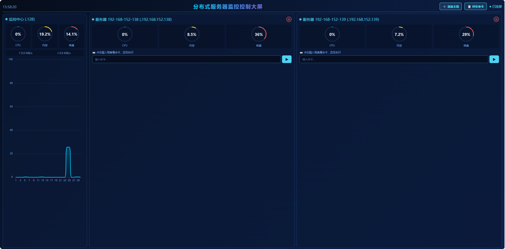
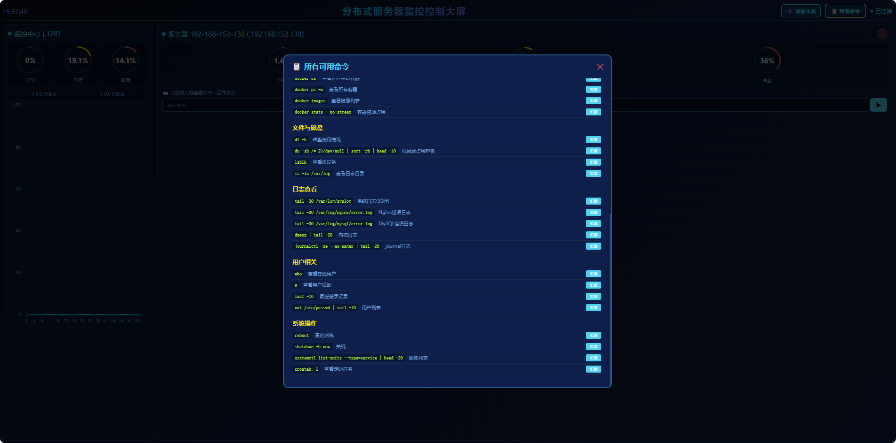
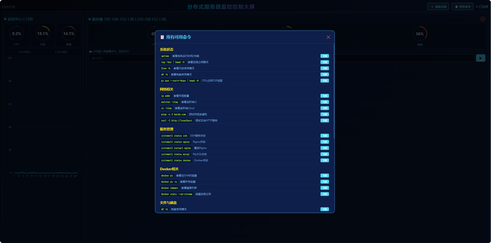
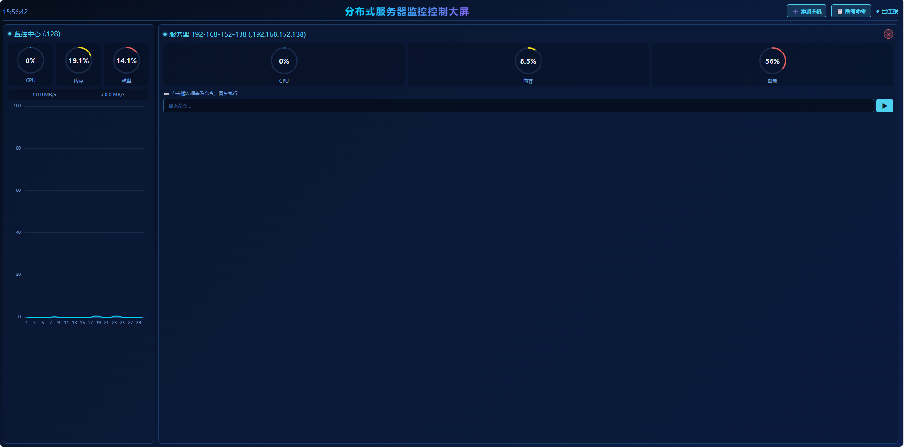
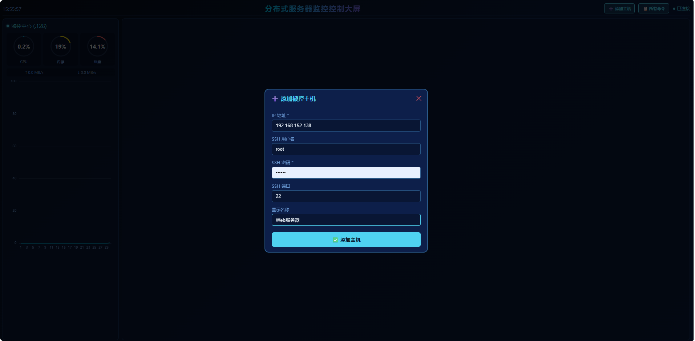
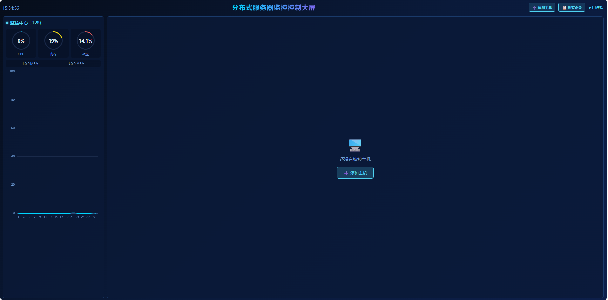

# 🖥️ 分布式服务器监控控制大屏

**一个前后端分离、支持远程命令控制的轻量级服务器实时监控大屏系统**

---

## 📑 目录

1. [系统简介](#系统简介)
2. [核心特性](#核心特性)
3. [系统架构](#系统架构)
4. [技术栈](#技术栈)
5. [快速开始](#快速开始)
6. [功能说明](#功能说明)
7. [API文档](#api文档)
8. [配置说明](#配置说明)
9. [常见问题](#常见问题)

---

## 系统简介

这是一个基于 **Vue3 + FastAPI** 开发的轻量级分布式服务器监控与控制系统。本项目最大的特点是在提供美观的实时数据大屏的同时，**深度集成了远程命令控制功能**，能够通过大屏直接对任意被控主机执行预设或自定义的Linux命令，实现监控与管理的闭环。

系统完全自研，未依赖任何第三方大屏组件库，纯手写CSS/JavaScript实现所有可视化效果，非常适合作为毕业设计或课程作业，展示全栈开发能力。

### 适用场景

- 📺 **期末作业/课程设计**：全栈技术实践，业务逻辑完整，可视化效果好
- 🖥️ **运维监控看板**：快速搭建，实时查看多台服务器的CPU、内存、磁盘状态
- 🎮 **轻量级运维工具**：统一入口，通过浏览器安全地对多台服务器执行命令
- 🌐 **跨网段管理**：支持添加不同网段的被控主机（需网络可达）

---

## 核心特性

### 🎯 主要功能

#### 1. 实时监控指标
- ✅ **CPU使用率**：精确到0.1%，环形仪表盘实时更新
- ✅ **内存使用率**：环形仪表盘展示，每2秒刷新
- ✅ **磁盘使用率**：根分区空间占用监控
- ✅ **网络速度**：本机实时上传/下载速度（MB/s）
- ✅ **在线状态感知**：自动检测并提示被控主机的在线/离线状态

#### 2. 监控大屏
- 📺 **自适应多列布局**：被控主机列数根据添加数量动态增长
- 🔄 **2秒实时刷新**：WebSocket推送本机及所有远端主机数据
- 📊 **多维度可视化**
  - 本机监控中心：CPU/内存/磁盘环形图 + 网络流量 + CPU趋势折线图
  - 被控主机列：每台主机独立显示环形图 + 命令执行区
  - 全局命令弹窗：分类展示所有可用命令，支持一键执行

#### 3. 远程命令控制（核心亮点）
- ➕ **动态添加主机**：界面输入IP、用户名、密码即可添加，无需修改配置文件
- ⌨️ **智能命令提示**：点击输入框自动弹出分类命令列表（8大类40+条）
- 🔍 **实时命令过滤**：输入关键词实时过滤匹配命令，支持键盘选择
- ▶️ **一键执行与反馈**：SSH远端执行，结果实时返回黑色终端区域
- ✂️ **动态移除主机**：动态添加的主机列可一键移除

#### 4. 命令管理
- 📚 **预置命令库**：系统状态、网络、服务、Docker、磁盘、日志、用户、系统操作
- 🗂️ **全局命令弹窗**：分类展示，为每台在线主机提供一键执行按钮
- ✏️ **自定义命令**：支持执行任意Linux命令

---

## 系统截图

















## 系统架构

```text
┌──────────────────────────────────────────────────────────┐
│               监控控制中心 (192.168.152.128)                │
│  ┌─────────────────┐        ┌─────────────────┐          │
│  │  Vue3 前端大屏   │◄──────►│  FastAPI 后端    │          │
│  │   (Port: 3000)  │  API   │   (Port: 8000)  │          │
│  └─────────────────┘        └────────┬────────┘          │
│                                      │                    │
│                             WebSocket│实时推送            │
│                             HTTP POST│控制命令            │
└──────────────────────────────────────┼────────────────────┘
                                       │
                                       │ Paramiko (SSH)
                                       ▼
        ┌──────────────────────────────────────────┐
        │              被监控服务器集群               │
        │  ┌──────────┐ ┌──────────┐               │
        │  │ .138     │ │ .139     │ ...           │
        │  │Web服务器  │ │数据库服务器│               │
        │  └──────────┘ └──────────┘               │
        └──────────────────────────────────────────┘
```

### 工作流程

1. **动态挂载**：用户在Web界面输入主机信息，后端通过API动态添加
2. **实时采集**：后端通过Paramiko (SSH)执行 `top`, `free`, `df` 等命令采集数据
3. **数据推送**：WebSocket每2秒推送本机及所有远端主机的聚合数据
4. **前端渲染**：Vue3驱动环形图和趋势图实时更新
5. **交互控制**：用户选择命令，HTTP API发送指令，SSH执行并返回结果

## 技术栈

### 后端技术

| 技术            | 用途                                |
| :-------------- | :---------------------------------- |
| **Python 3.10** | 主要编程语言                        |
| **FastAPI**     | 高性能Web框架，REST API + WebSocket |
| **Uvicorn**     | ASGI服务器                          |
| **Paramiko**    | SSH客户端，远程命令执行和数据采集   |
| **psutil**      | 本机系统资源监控                    |

### 前端技术

| 技术           | 用途                            |
| :------------- | :------------------------------ |
| **Vue 3**      | 渐进式前端框架，Composition API |
| **Vite 5**     | 前端构建工具                    |
| **Axios**      | HTTP客户端                      |
| **ECharts 5**  | 数据可视化（CPU趋势图）         |
| **纯CSS/HTML** | 手写大屏样式、环形图、弹窗      |

------

## 快速开始

### 前置要求

- **Python**: 3.9+
- **Node.js**: 18.x+
- **网络**: 监控机能SSH连接到所有被监控主机

### 启动步骤

**1. 启动后端**

bash

```
cd ~/monitor-control-dashboard/backend
source venv/bin/activate
uvicorn main:app --host 0.0.0.0 --port 8000 --reload
```


**2. 启动前端**

bash

```
cd ~/monitor-control-dashboard/frontend
npm run dev -- --host 0.0.0.0
```


**3. 访问系统**
浏览器打开 `http://<你的监控机IP>:3000`

**4. 添加第一台主机**

1. 点击右上角 `➕ 添加主机`
2. 填写IP地址、SSH用户名、密码、端口、显示名称
3. 点击 `✅ 添加主机`，大屏自动增加一列

------

## 功能说明

### 监控中心面板

- 固定展示本机CPU/内存/磁盘环形图
- 网络实时上传/下载速度
- CPU使用率历史趋势折线图

### 被控主机面板

- **动态添加**：表单输入即可创建新列
- **实时指标**：独立显示每台主机的环形图
- **命令执行区**：智能提示、搜索过滤、键盘选择、结果展示
- **移除按钮**：动态主机可一键移除

### 全局命令弹窗

- 8大类别、40+条预置命令
- 每条命令可对任意在线主机一键执行

------

## API文档

| 方法      | 路径              | 说明             |
| :-------- | :---------------- | :--------------- |
| GET       | `/servers`        | 获取所有主机列表 |
| POST      | `/servers/add`    | 动态添加主机     |
| POST      | `/servers/remove` | 移除指定主机     |
| GET       | `/commands`       | 获取所有可用命令 |
| POST      | `/control`        | 执行远程命令     |
| WebSocket | `/ws`             | 实时推送监控数据 |

------

## 常见问题

### 添加主机后显示"离线"

- `ping` 被控主机IP检查网络
- `ssh 用户名@IP` 测试凭据和端口
- 确保22端口开放

### 命令提示不弹出

- 确认后端服务正常运行
- 检查前端控制台报错

### 环形图数据不更新

- 确认WebSocket连接状态为"已连接"
- SSH到被控机手动执行监控命令检查兼容性